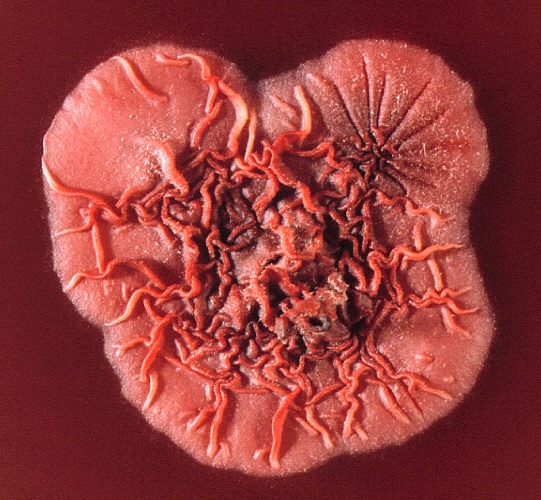

# Welcome to my blog
This summer is going to be fun for me!   
- I am taking a statistics course, [Data Science for Statisticians](https://wolfware.ncsu.edu/courses/details/?sis_id=SIS:2021:8:1:ST:558:601), at NCSU  
- I'm also working on a project at the [Duke Center For AIDS Research](https://cfar.duke.edu/).    
In this project I intend to build a model that will predict whether an antigen test will be positive.   
The antigen indicates the presence of a deadly fungal infection that affects patients with advanced HIV disease.   

Here is a picture of a colony of this fungus.    

